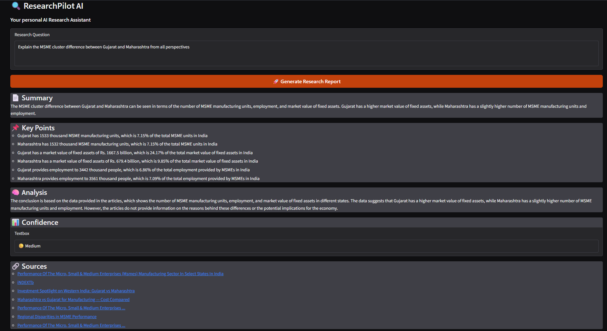

# 🔎 ResearchPilot AI

**ResearchPilot AI is a real-time AI research assistant that searches the web, collects relevant sources, analyzes the retrieved information, and generates a structured research report with source references.**

Instead of relying only on the LLM's internal knowledge, ResearchPilot retrieves information from the web at query time and uses that information as the basis for its response.

> **Ask a question → Search the web → Collect sources → Analyze evidence → Generate a research report**

---

## 🚀 Features

* 🔍 **Real-time web research**

  * Generates multiple search queries from a user's question.
  * Searches the web for relevant sources.

* 🧠 **Query planning**

  * Classifies queries into simple, comparison, and research queries.
  * Generates multiple search queries for broader research coverage.

* 🌐 **Web scraping**

  * Retrieves content from web pages.
  * Detects and skips non-HTML content such as PDFs.
  * Handles failed or inaccessible sources without stopping the entire pipeline.

* 🔄 **Duplicate removal**

  * Removes duplicate URLs returned by different search queries.

* 🤖 **LLM-powered analysis**

  * Uses Llama 3.3 70B through Groq.
  * Generates structured research reports from retrieved sources.

* 📋 **Structured output**

  * Reports contain:

    * Summary
    * Key findings
    * Analysis
    * Confidence level
    * Sources

* ✅ **Response validation**

  * Uses Pydantic to validate LLM-generated JSON before returning the result.

* 📊 **Interactive Gradio interface**

  * Simple interface for submitting research questions.
  * Displays progress while research is being performed.

---

## 🏗️ Architecture

```text
                         User Query
                             │
                             ▼
                     ┌───────────────┐
                     │ Query Planner │
                     └───────┬───────┘
                             │
                  Generated Search Queries
                             │
                             ▼
                     ┌───────────────┐
                     │  Web Search   │
                     └───────┬───────┘
                             │
                             ▼
                    Search Result URLs
                             │
                             ▼
                     ┌───────────────┐
                     │ Deduplication │
                     └───────┬───────┘
                             │
                             ▼
                     ┌───────────────┐
                     │    Scraper    │
                     └───────┬───────┘
                             │
                             ▼
                       Source Content
                             │
                             ▼
                     ┌───────────────┐
                     │   LLM / Groq  │
                     └───────┬───────┘
                             │
                             ▼
                  Structured Research Report
                             │
                    ┌────────┴────────┐
                    ▼                 ▼
                 Analysis           Sources
```

---

## 🧩 Project Structure

```text
ResearchPilot_AI/
│
├── src/
│   ├── query_planner.py       # Query classification and query generation
│   ├── search.py              # Web search client
│   ├── scraper.py             # Web page retrieval and text extraction
│   ├── research.py            # Main research pipeline
│   ├── llm.py                 # Groq/LLM client
│   ├── prompts.py             # LLM prompt construction
│   ├── models.py              # Pydantic response models
│   └── config.py              # Environment configuration
│
├── app.py                     # Gradio application
├── requirements.txt           # Python dependencies
├── README.md
├── .gitignore
└── .env                       # Local environment variables (not committed)
```

---

## ⚙️ How It Works

### 1. User submits a question

Example:

```text
Compare the MSME clusters of Gujarat and Maharashtra.
```

### 2. Query Planner generates search queries

Instead of searching only the original question, ResearchPilot generates multiple search queries covering different aspects of the question.

Example:

```text
MSME cluster comparison Gujarat Maharashtra

Gujarat vs Maharashtra MSME industry differences

Regional differences in MSME clusters Gujarat and Maharashtra
```

### 3. Web search

Each generated query is sent to the search service.

The returned results are combined and duplicate URLs are removed.

### 4. Web scraping

ResearchPilot attempts to retrieve the content of each source.

Non-HTML resources and inaccessible pages are skipped rather than crashing the research process.

### 5. LLM analysis

The retrieved source content is passed to the LLM with instructions to:

* Use only the supplied information.
* Avoid unsupported claims.
* Identify limitations.
* Produce structured JSON.

### 6. Response validation

The generated JSON is validated using Pydantic.

Invalid responses are rejected instead of being silently returned to the user.

### 7. Final research report

The validated response is displayed through the Gradio interface together with the sources used.

---

## 🛠️ Tech Stack

| Technology    | Purpose                   |
| ------------- | ------------------------- |
| Python        | Core application          |
| Gradio        | User interface            |
| Groq          | LLM API                   |
| Llama 3.3 70B | Research analysis         |
| Requests      | HTTP requests             |
| BeautifulSoup | Web scraping              |
| Pydantic      | Response validation       |
| python-dotenv | Environment configuration |
| Git / GitHub  | Version control           |

---

## 🔐 Environment Variables

Create a `.env` file in the project root:

```env
LLM_PROVIDER=groq
LLM_API_KEY=your_api_key
LLM_MODEL=llama-3.3-70b-versatile
LLM_TEMPERATURE=0.3
LLM_MAX_TOKENS=1000
```

### Important

Never commit your `.env` file or API keys to GitHub.

Your `.gitignore` should include:

```gitignore
.env
.venv/
__pycache__/
*.pyc
```

---

## 🏃 Running Locally

### 1. Clone the repository

```bash
git clone https://github.com/KartikParasher01/researchpilot-ai.git
cd researchpilot-ai
```

### 2. Create a virtual environment

```bash
python -m venv .venv
```

### 3. Activate it

Windows PowerShell:

```powershell
.venv\Scripts\Activate.ps1
```

### 4. Install dependencies

```bash
pip install -r requirements.txt
```

### 5. Configure environment variables

Create `.env` and add the required API configuration.

### 6. Run the application

```bash
python app.py
```

The Gradio application will be available locally at:

```text
http://127.0.0.1:7860
```

---

## 📄 Example Output

For a query such as:

```text
Explain the MSME cluster difference between Gujarat and Maharashtra.
```

ResearchPilot produces a structured report containing:

```text
Summary
Key Points
Analysis
Confidence
Sources
```

The system also reports when the retrieved sources do not provide enough evidence to answer a question confidently.

---

## ⚠️ Current Limitations

ResearchPilot is currently a **prototype / MVP**, not a production research platform.

Current limitations include:

* Web pages can fail to load or block automated requests.
* Some search results may be PDFs or other non-HTML resources.
* Some websites may reject scraping requests.
* Search-result quality depends on the search provider.
* The system currently relies on a limited number of retrieved sources.
* Multi-source context handling still needs further improvement.
* Research quality depends on the quality and availability of retrieved sources.
* API rate limits may affect usage.

The system intentionally avoids making unsupported claims when the retrieved evidence is insufficient.

---

## 🔮 Future Improvements

Possible future improvements include:

* Better source relevance ranking.
* Semantic retrieval using embeddings.
* Chunk-level retrieval instead of passing entire articles.
* Hybrid keyword + semantic search.
* Better source quality scoring.
* Improved citation mapping between claims and sources.
* Parallel scraping for faster research.
* Caching frequently accessed sources.
* More robust handling of dynamic websites.
* Evaluation framework for research accuracy.
* Deployment as a public web application.

---

## 🎯 What I Learned Building This

This project was built to understand how an AI research system works end-to-end.

Key concepts explored:

* LLM API integration
* Prompt engineering
* Structured LLM output
* Pydantic validation
* Query planning
* Web search
* Web scraping
* Data cleaning
* Source deduplication
* Error handling
* Retrieval pipelines
* Gradio application development
* Environment and API-key management
* Git and GitHub workflow

---

## 📌 Project Status

**Status: MVP / Portfolio Project**

ResearchPilot currently demonstrates the complete flow from a user's research question to a web-grounded, structured AI research report.

The project is intentionally being kept lightweight rather than adding unnecessary infrastructure such as a persistent vector database or RAG pipeline.

---

## 👨‍💻 Author

**Kartik Parasher**

Built as a practical project to explore AI-powered research systems, LLM applications, web retrieval, and Python-based AI engineering.


## Result Preview



